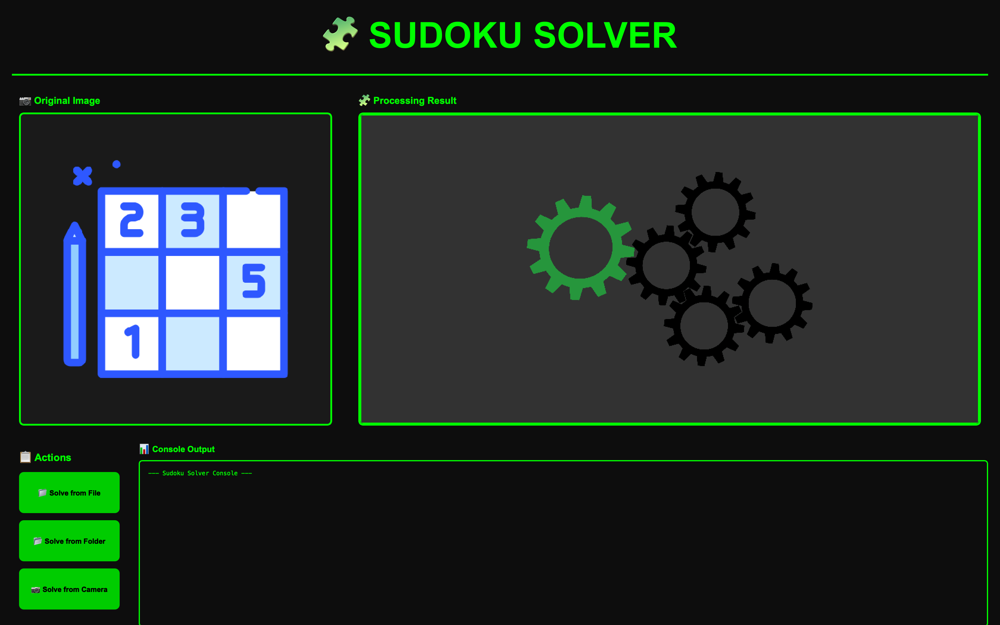
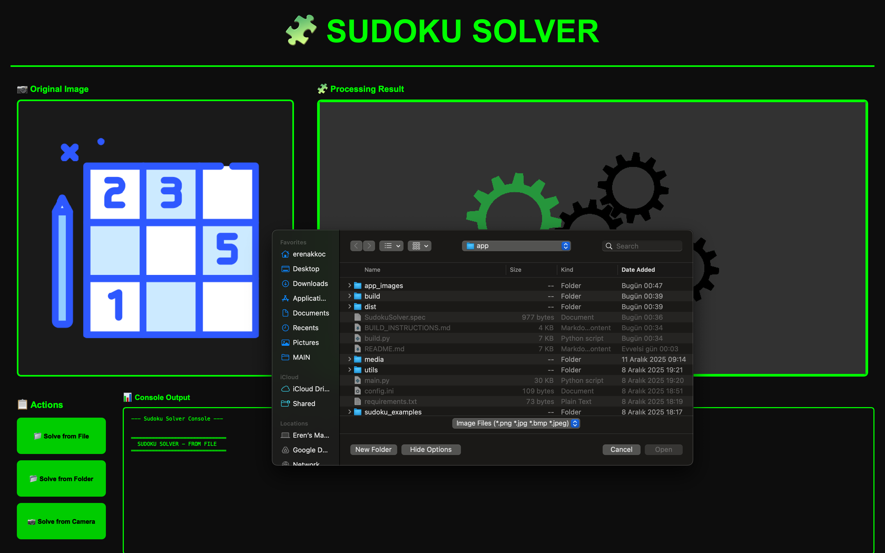
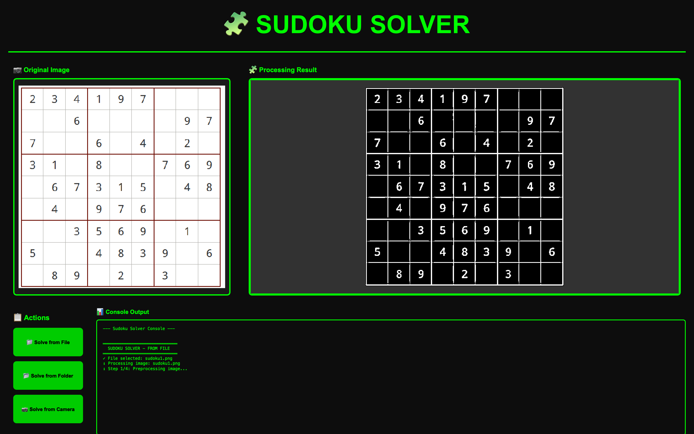
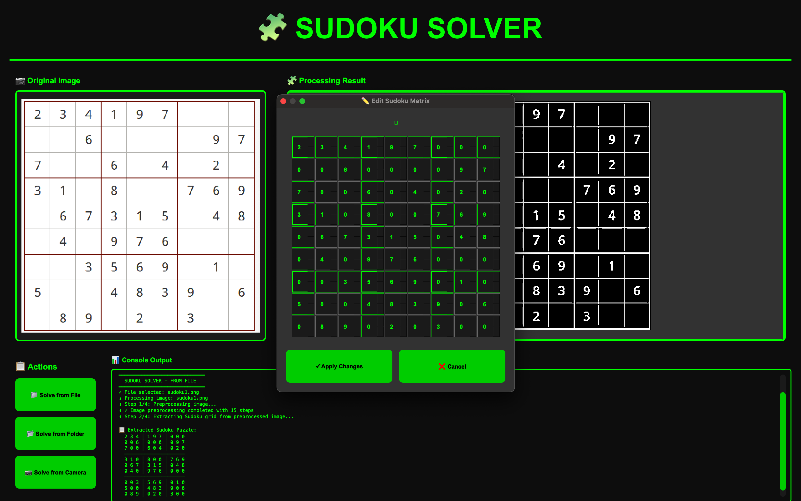
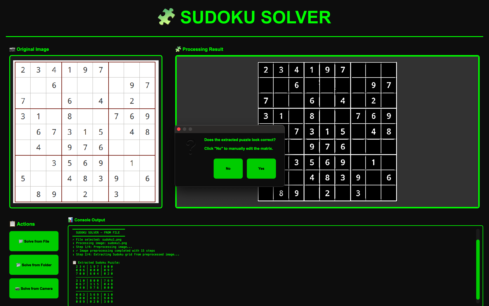
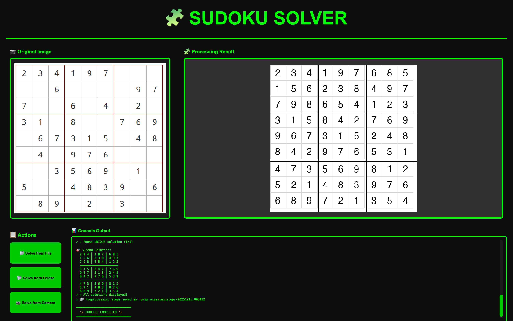

# 🧩 Sudoku Solver

A powerful desktop application that solves Sudoku puzzles using image processing and SAT (Boolean Satisfiability) algorithms. Built with PyQt5 and powered by AI-based image recognition.


*Main application interface with dual-panel display*

## ✨ Features

- **📁 Multiple Input Methods**
  - Solve from image files
  - Batch processing from folders
  - Real-time camera capture

- **🔍 Advanced Image Processing**
  - Automatic Sudoku grid detection
  - Cell extraction and digit recognition
  - Preprocessing pipeline with step-by-step visualization

- **🧠 Smart Solving Algorithm**
  - SAT-based solving using Boolean constraints
  - Fast and reliable solutions
  - Validation of solvable puzzles
  - **Multiple solution detection** - Finds all possible solutions (up to 10)
  - Blocking clause technique for alternative solutions

- **✏️ Manual Editing**
  - Interactive matrix editor for corrections
  - User verification of extracted puzzles
  - Easy cell-by-cell editing with visual 3x3 block separation

- **🔄 Advanced AI Recognition**
  - Improved Gemini AI prompts for better accuracy
  - Automatic retry mechanism (up to 3 attempts)
  - Matrix validation and error detection
  - Gemini 2.0 Flash Exp model for enhanced vision

- **🎨 Modern GUI**
  - Full-screen desktop application
  - Real-time preview of original and processed images
  - **Grid layout for multiple solutions** with 2-column display
  - **Clickable images** - Popup enlargement on click
  - Scrollable solution panel
  - Console output for detailed logs

##  Screenshots

### Main Interface

*Clean, modern interface with dark theme and dual-panel display*

### File Selection

*Select Sudoku image from file system*

### Image Preprocessing

*Step-by-step image preprocessing and grid detection*

### Matrix Verification & Editing

*Interactive 9x9 matrix editor for manual corrections*

### Verification Dialog

*User verification prompt before solving*

### Solution Display

*Solved Sudoku puzzle with clear visualization*

## �🚀 Installation

### Prerequisites

- Python 3.8 or higher
- pip package manager

### Setup

1. Clone the repository:
```bash
git clone <repository-url>
cd app
```

2. Install required dependencies:
```bash
pip install -r requirements.txt
```

3. Configure API settings:
   - Copy `config.ini.example` to `config.ini`
   - Add your Google Generative AI API key:
   ```ini
   [GENAI]
   API_KEY = your_api_key_here
   ```

## 📖 Usage

### Running the Application

```bash
python main.py
```

### Solving Sudoku Puzzles

1. **From File**: Click "📁 Solve from File" and select an image containing a Sudoku puzzle
2. **From Folder**: Click "📂 Solve from Folder" to batch process multiple Sudoku images
3. **From Camera**: Click "📷 Solve from Camera" to capture a Sudoku puzzle in real-time

### Matrix Verification & Editing

After extracting the puzzle from an image, the application will:
1. **Display the extracted matrix** in the console
2. **Ask for verification**: "Does the extracted puzzle look correct?"
3. If you click **"No"**, a matrix editor will open where you can:
   - Edit any cell value (0-9)
   - See 3x3 blocks visually separated
   - Apply changes or cancel

### Multiple Solutions

- If a puzzle has **exactly 1 solution**: Displays "Found UNIQUE solution"
- If a puzzle has **multiple solutions**: 
  - Shows warning about multiple solutions
  - Displays all solutions in a scrollable 2-column grid
  - Each solution can be clicked to view enlarged
  - Console shows detailed count and all matrices

### Supported Image Formats

- PNG
- JPG/JPEG
- BMP
- Images should clearly show a 9×9 Sudoku grid

## 🛠️ Technologies Used

- **PyQt5**: Desktop GUI framework with interactive widgets
- **OpenCV**: Image processing and computer vision
- **Google Generative AI (Gemini 2.0 Flash Exp)**: Advanced digit recognition from grid cells
- **Python-SAT (Glucose3)**: Boolean satisfiability solver for Sudoku logic
- **PIL/Pillow**: Image manipulation and solution rendering
- **NumPy**: Numerical operations

## 📁 Project Structure

```
app/
├── main.py                    # Main application entry point
├── config.ini                 # Configuration file (not tracked)
├── requirements.txt           # Python dependencies
├── media/                     # Application assets
│   └── icon.png              # Application icon
├── sudoku_examples/          # Sample Sudoku images
├── utils/                    # Utility modules
│   ├── image_preprocessing.py    # Image processing pipeline
│   ├── image2matrix.py          # Grid extraction and OCR
│   ├── matrix2image.py          # Solution visualization
│   ├── solving_algorithm.py     # SAT-based solver
│   ├── output_printer.py        # Console output handler
│   ├── style.py                 # GUI styling
│   └── check_requirements.py   # Dependency checker
└── preprocessing_steps/      # Debug images (not tracked)
```

## 🎯 How It Works

1. **Image Preprocessing**: The input image is preprocessed to detect and extract the Sudoku grid
2. **Cell Extraction**: Each cell in the 9×9 grid is isolated
3. **Digit Recognition**: Google's Generative AI (Gemini 2.0 Flash Exp) identifies digits in each cell
   - Improved prompts for better empty cell detection
   - Automatic retry mechanism (up to 3 attempts)
   - Matrix validation (9x9 size, 0-9 values)
4. **User Verification**: User can manually edit the matrix if needed
5. **SAT Solving**: The puzzle is converted to Boolean constraints and solved using a SAT solver
   - Checks for multiple solutions
   - Uses blocking clauses to find alternative solutions
6. **Visualization**: 
   - Single solution: Displayed in the main panel
   - Multiple solutions: Grid layout with clickable thumbnails
   - All solutions saved as separate PNG files

## 📝 Example Puzzles

Sample Sudoku images are provided in the `sudoku_examples/` folder for testing.

## ⚠️ Troubleshooting

- **API Key Error**: Make sure your Google Generative AI API key is correctly set in `config.ini`
- **Image Recognition Issues**: 
  - Ensure the image is clear and well-lit with a visible grid
  - Use the manual matrix editor to correct any misrecognized cells
  - The application will retry up to 3 times automatically
- **Missing Dependencies**: Run `pip install -r requirements.txt` again
- **Multiple Solutions Warning**: Well-designed Sudoku puzzles should have exactly 1 solution. If multiple solutions are found, check if the extracted matrix is correct using the manual editor.
- **Deleted Widget Error**: If you encounter widget deletion errors, restart the application

## 🤝 Contributing

Contributions are welcome! Please feel free to submit a Pull Request.

## 📄 License

This project is developed as part of a Discrete Mathematics course project.

## 👥 Authors

Developed for the Discrete Mathematics course at university.

---

**Note**: This application requires an active internet connection for digit recognition via Google's Generative AI API.
